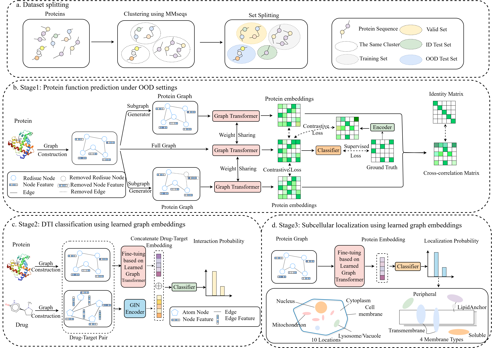

# ProteinGGT: Generalized Graph Transformer Enhances Protein Function Annotation under Out-of-distribution Contexts
## Overview
Understanding protein function in biological processes is pivotal for disease elucidation and drug discovery. While previous studies have shown promising progress, two critical challenges remain: generalizing to novel, diverse, and non-homologous protein sequences, and establishing a broadly applicable framework across multiple applications. Here, we introduce ProteinGGT, a generalized graph transformer based method designed for protein function prediction in out-of-distribution scenarios. ProteinGGT effectively annotates protein functions for diverse and dissimilar sequences, leveraging self-supervised contrastive learning to identify significant features and filter out redundant ones through a subgraph generator. Benchmarking on two less homologous test sets, ProteinGGT demonstrates superior performance against baselines, providing strong biological interpretability. Additionally, we then fine-tune ProteinGGT for two downstream tasks, drug-target interaction (DTI) prediction and subcellular localization, yielding higher predictive accuracy than other state-of-the-art baselines on OOD test sets and providing interpretable insights into the prediction results.

