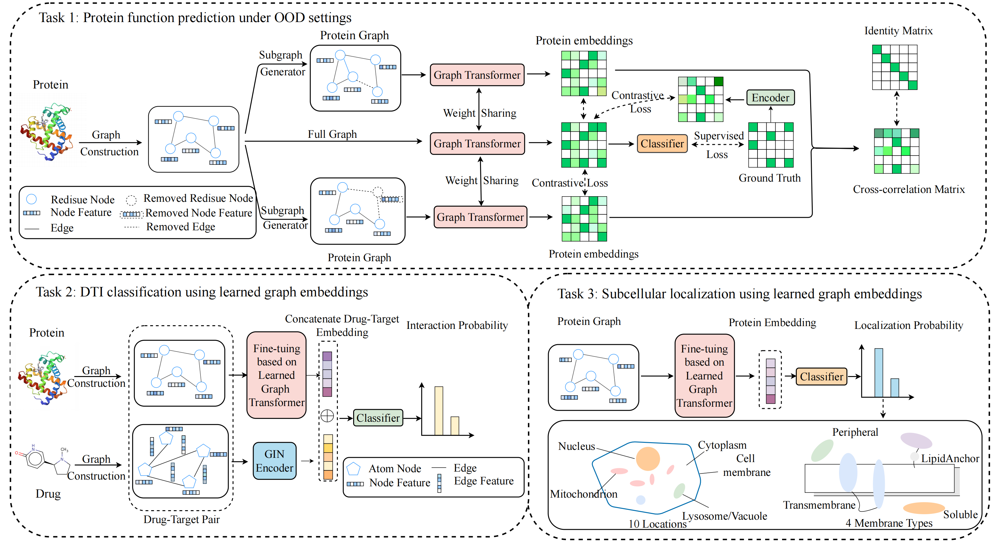

# ProteinScore: Out-of-distribution Generalization Enhances Protein Function Annotation for Low Homologous Sequences
## Overview
Here, we introduce ProteinScore, a generalized graph transformer based method designed for protein function prediction in out-of-distribution scenarios. Additionally, we then fine-tune ProteinGGT for two downstream tasks, drug-target interaction (DTI) prediction and subcellular localization, yielding higher predictive accuracy than other state-of-the-art baselines on OOD test sets and providing interpretable insights into the prediction results.



## Installation

Start by following this source codes:
```bash
git clone https://github.com/fuyw-aisw/ProteinScore.git
cd ProteinScore
conda env create -f environment.yml
## or install the following dependencies
## step1: install PyTorch’s CUDA support on Linux
pip install torch==1.7.1+cu110 torchvision==0.8.2+cu110 torchaudio==0.7.2 -f https://download.pytorch.org/whl/torch_stable.html
## step2: install pyg package
pip install torch_scatter torch_sparse torch_cluster torch_spline_conv torch_geometric -f https://data.pyg.org/whl/torch-1.7.1%2Bcu110.html ### GPU
## step2: or install by the following source codes
pip install https://data.pyg.org/whl/torch-1.7.0%2Bcu110/torch_cluster-1.5.8-cp37-cp37m-linux_x86_64.whl
pip install https://data.pyg.org/whl/torch-1.7.0%2Bcu110/torch_scatter-2.0.5-cp37-cp37m-linux_x86_64.whl
pip install https://data.pyg.org/whl/torch-1.7.0%2Bcu110/torch_sparse-0.6.9-cp37-cp37m-linux_x86_64.whl
pip install https://data.pyg.org/whl/torch-1.7.0%2Bcu110/torch_spline_conv-1.2.1-cp37-cp37m-linux_x86_64.whl
pip install torch_geometric==1.6.3
pip install fair-esm
```
## Train
For protein function prediction
```bash
python train.py
```
